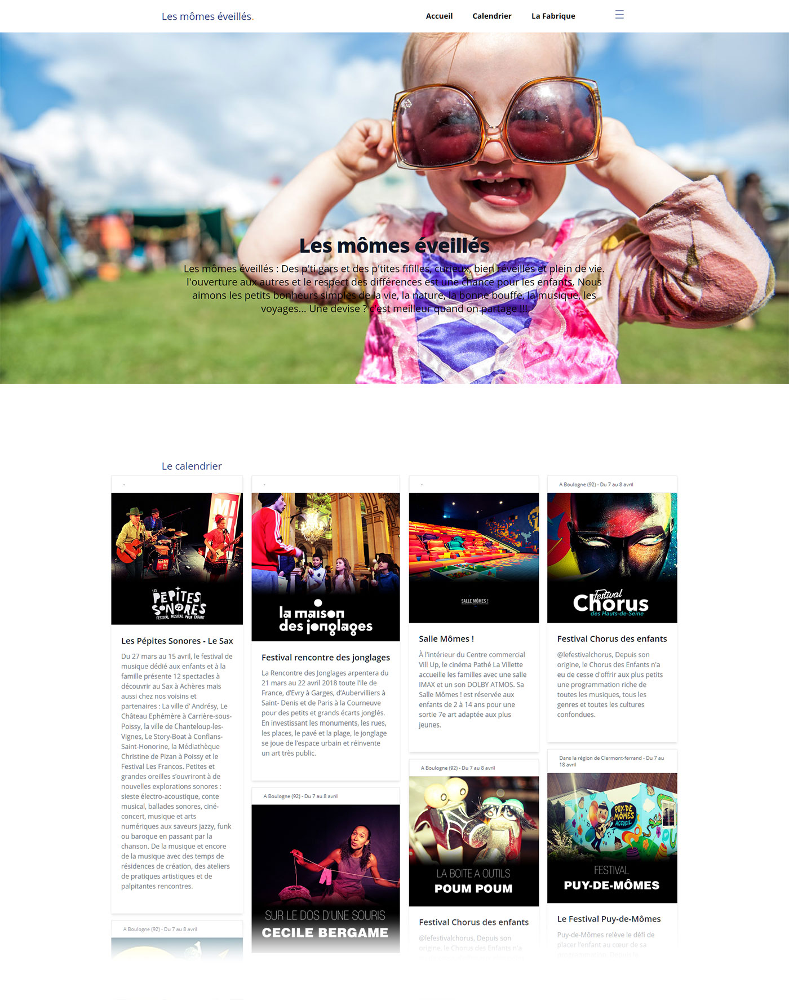

# Les mômes éveillés
Des p'ti gars et des p'tites fifilles, curieux, bien réveillés et plein de vie. l'ouverture aux autres et le respect des différences est une chance pour les enfants. Nous aimons les petits bonheurs simples de la vie, la nature, la bonne bouffe, la musique, les voyages... Une devise ? c'est meilleur quand on partage !!! Ici, ce sera un echange de bons plans sorties, concerts, festivals et voyages pour que nos enfants s'éveillent. ---- L'ouverture aux autres est une chance pour les enfants. Une devise ? c'est meilleur quand on partage !!! Ici festivals et voyages avec et pour nos bébés.


## Site

```javascript
Accès

// http://localhost:8080/ -> 
```


:bulb: **Développé avec :vuejs,html5,tailwincss,css3,sass,masonry,pwa** 

## Table des matières

- [Install](#install)
- [Concept du Projet](#options)
- [Rendu](#rendu)
- [Vérifications](#verifications)
- [License](#license)

## Install

Installer NodeJs en allant sur le site https://nodejs.org/en/ et en le téléchargeant.
Lancer git bash
Ecrire les lignes suivantes : 

```javascript
$ npm install -g @vue/cli
$ vue create les-momes-eveilles
$ cd my-project
$ npm install vue-router // On peut faire une single page avec VueRouter qui suivant l'url va charger certains composants https://router.vuejs.org/
$ npm install popper.js jquery
$ npm install --save-dev sass sass-loader
$ npm install -g sass
$ npm install tailwindcss@npm:@tailwindcss/postcss7-compat postcss@^7 autoprefixer@^9
$ ./node_modules/.bin/tailwind init tailwind.js // création du fichier tailwind.js
$ npm install vue-masonry
$ npm i vue-masonry-wall // Masonry en Vue.js
$ npm i vue-horizontal-list // Carroussel en Vue.js
$ npm install aos --save // Animations en Vue.js
$ cd src/assets/sass
$ sass  --watch tailwind.scss:tailwind.css --style compressed
$ npm run serve
```
Si besoin de désinstaller : npm uninstall ...

## Concept du Projet


- **contexte**:
- **options**: 

## Example


```javascript
Dans VS Code
Ajouter les extensions : Live Sass Compiler et Vetur
```
### Rendu


[](https://Cecile-Bordes.github.io/les-momes-eveilles/Rendu/)

### Vérifications

- **La page est responsive, fonctionne sur Chrome, Firefox, Edge.**:
- **Le score au niveau des indicateurs de chrome lighthouse**:
- **Validation W3C : https://validator.w3.org/#validate_by_upload**:
- **Vérification chargement page : https://developers.google.com/speed/pagespeed/insights/?hl=fr**:
- **Convertisseur WEBP : https://www.onlineimagetool.com/fr/convert-png-jpg-webp-gif#**:

## License

The MIT License (MIT)

Copyright (c) 2021 Cécile